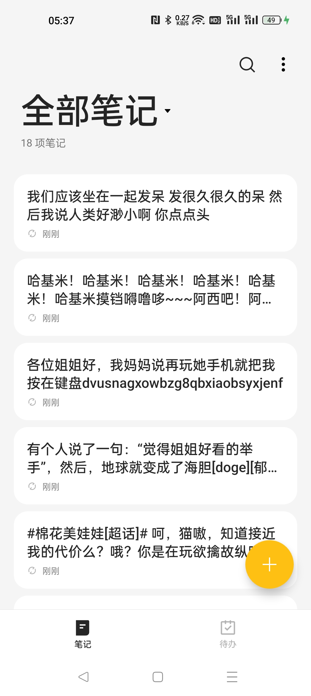
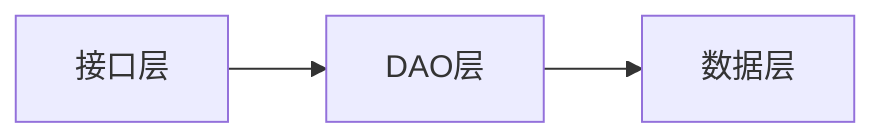
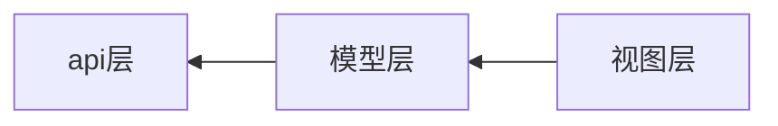

# 开发文档
# 需求分析
做一个像手机记事本一样的web记事本，支持多端使用

## 笔记  
笔记用来储存文本

笔记构成： 修改时间、标题、内容

笔记编辑页：

## 笔记列表
笔记列表用来显示所有笔记，列表项由标题、修改时间构成，按照修改时间排序。如果没有标题，就把内容前面的部分作为标题。

笔记列表页：


## 授权验证
需要输入授权码、或者用户密码才能访问
# 概要设计
## 架构
B/S，前端用三件套，后端用Python：FastAPI，数据库用Sqlite

后端：

前端：

## 数据库设计
## 后端
笔记（标题、内容、修改时间）  CRUD
## 前端
### 笔记列表页面
index.html  
点击添加笔记按钮，进入空的笔记编辑页面。  
点击笔记，使用url参数?note_id=xxx，进入有数据的笔记编辑页面
### 笔记编辑页面
edit.html   
编辑文本  
点击保存按钮，保存笔记
# 详细设计
## 后端
### 数据层
```sql
DROP TABLE IF EXISTS Note;
-- 创建笔记表
CREATE TABLE Note (
  id INTEGER PRIMARY KEY AUTOINCREMENT, -- 笔记ID，主键，自增长
  title TEXT, -- 标题
  content TEXT NOT NULL, -- 内容，非空
  modify_time DATETIME NOT NULL -- 修改时间，非空
);
```
### dao层
crud笔记模块：dao.note_dao.py
### 接口层
根路径：/api/v1/  
笔记crud接口： /notes
## 前端
### api层
笔记crud api：api.js，使用fetch()
### 模型层
笔记列表对象：

笔记内容对象：

# 扩展性
内容当下为文本，以后会支持更多格式