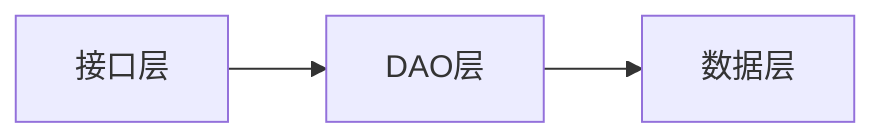
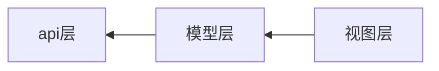

# 开发文档
# 需求分析
做一个像手机记事本一样的web记事本，支持多端使用

## 笔记  
笔记用来储存文本

笔记构成： 修改时间、标题、内容

笔记编辑页:  


## 笔记列表
笔记列表用来显示所有笔记，列表项由标题、修改时间构成，按照修改时间排序。如果没有标题，就把内容前面的部分作为标题。

笔记列表页:  


## 授权验证
需要输入授权码、或者用户密码才能访问
# 概要设计
## 架构
B/S，前端用三件套，后端用Python：FastAPI，数据库用Sqlite

后端：

前端：

## 后端
笔记（标题、内容、修改时间）  CRUD
## 前端
### 笔记列表页面
index.html  
点击添加笔记按钮，进入空的笔记编辑页面。  
点击笔记，使用url参数?note_id=xxx，进入有数据的笔记编辑页面
### 笔记编辑页面
edit.html   
编辑文本  
点击保存按钮，保存笔记

# 详细设计

## 模型设计

### 笔记（Note）

收集是想要保留一次转发、复制内容的单位。

**笔记的组成：**

id：唯一标识

摘要：摘要是内容的概括

内容：保存内容，内容以指定的格式储存在数据库中，使用解析方法解析，最终呈现在眼前

解析方法：如上

添加日期：字面意思

修改日期：字面意思

## 后端
### 数据层
```sql
DROP TABLE IF EXISTS Note;
-- 创建笔记表
CREATE TABLE Note (
  id INTEGER PRIMARY KEY AUTOINCREMENT, -- 笔记ID，主键，自增长
  title TEXT, -- 标题
  content TEXT NOT NULL, -- 内容，非空
  modify_time DATETIME NOT NULL -- 修改时间，非空
);
```
### dao层
crud笔记模块：dao.note_dao.py
### 接口层
### 响应格式
```json
{
  "success": true,
  "info": "业务消息",
  "data": {}
}
```
#### 请求接收
根路径：/api/v1/  
笔记crud接口： /notes
## 前端
### 请求层

文件夹为src/api，封装一些通用请求方法

#### 响应状态码处理：
判断响应状态码  
非200：异常，弹出异常请求消息  
200：正常，继续判断"success"键的值是否正常（为true）  
false：异常，弹出"info"键的值  
true：正常，继续业务  

#### 请求发送
笔记crud api：api.js，使用fetch()

### 组件层

文件夹为src/component，该层封装一些通用组件，可被业务对象或者页面使用

### 业务组件层（待启用）

储存业务需要的组件，比如笔记中的一个卡片这种，现在暂时和视图层混合在一起。

还没考虑好要不要分离，目前业务组件只在一个路由页面显示，好像没有必要分离。

### 视图层

文件夹为src/view，储存业务需要的特殊视图，根目录一般与路由相关

### 路由层

### 状态层

### 储存层
